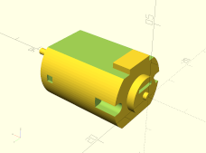

Model a hobby DC motor - "130 Size" 6V motor with 29mm long body

Copyright 2019 Craig Ringer <ringerc@ringerc.id.au>

BSD Licensed

This isn't particularly modular or reusable, you have to edit the script to
set parameters. I couldn't be bothered coming up with a sensible way to load
the measurement configuration in openscad and didn't have a different shaped
motor to do tests with anyway.

May optionally generate axle as separate part separated by tiny sleeve hollow.

May optionally generate masking-out blocks for wiring, in case you're
subtracting this model from another one like I did.

Examples of this motor at time of writing:

* https://www.adafruit.com/product/711
* https://core-electronics.com.au/brushed-dc-motor-130-size-6v-11-5krpm-800ma-stall.html
